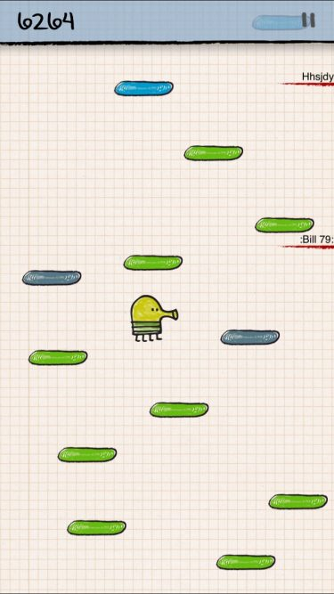

# Projektrepo för Grupp B06 i kursen TDDI82

Det här är repot för det projekt där vi har som mål att göra ett platform-spel i stil med spelet doodle jump.
För en mer utförligare beskrivning, se projektbeskrivningen i /doc/.



## Användning
```bash
#Spelet behöver SFML för att kunna kompileras
sudo apt install libsfml-dev

#Bygg spelet med:
make

#Kör spelet med:
make run

#För att både bygga och direkt köra spelet:
make test

#Vid problem eller oväntade buggar, kompilera om efter att du kört:
make clean
```
